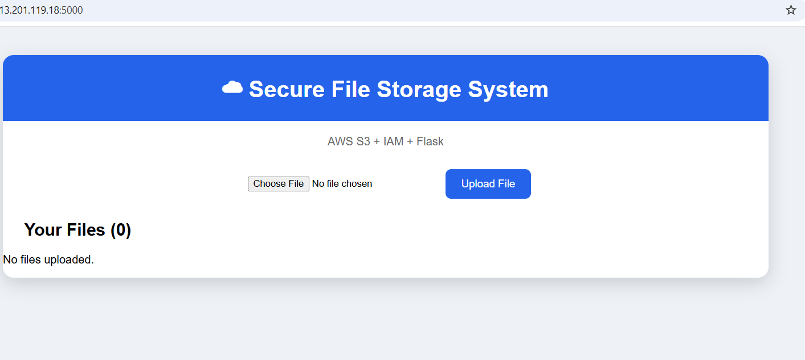
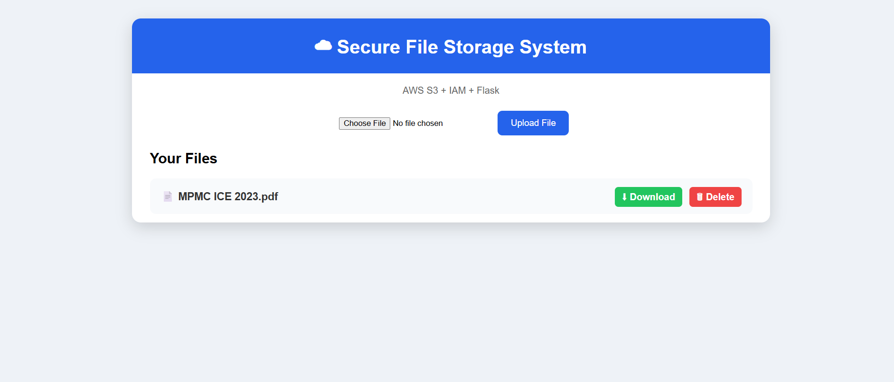
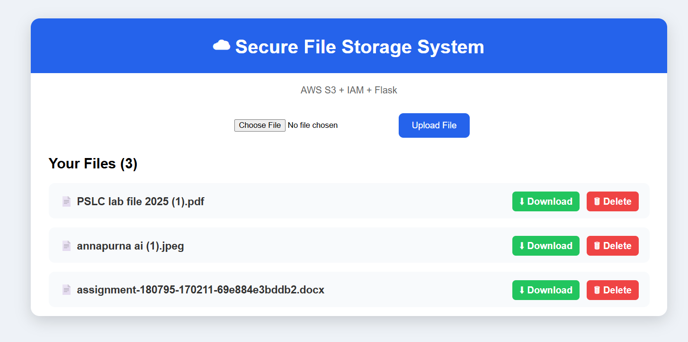
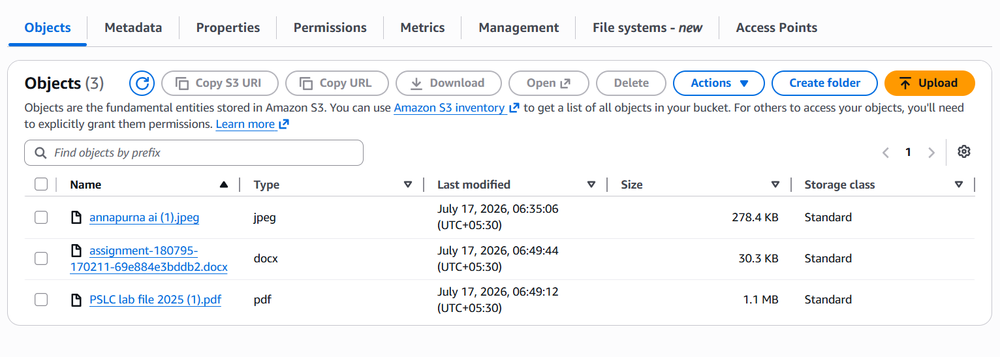
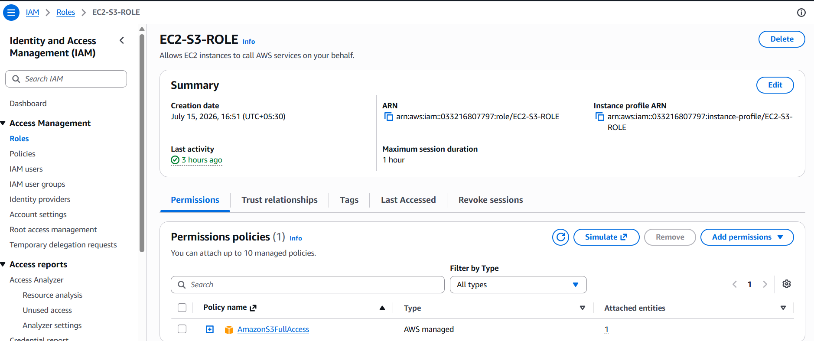
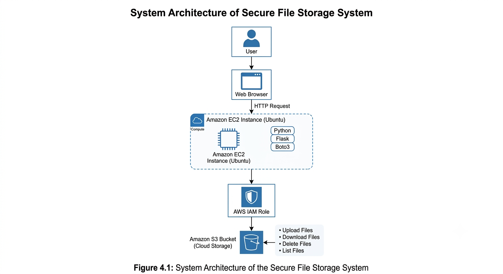

# Secure File Storage System using AWS S3 and IAM

## Overview

The Secure File Storage System is a cloud-based web application developed using Flask, AWS S3, and AWS IAM. It allows users to securely upload, download, view, and delete files stored in an Amazon S3 bucket through a simple web interface.

This project demonstrates cloud storage integration, secure access management, and web application development using AWS services.

---

## Features

- Upload files to Amazon S3
- Download stored files
- Delete files from S3
- View all uploaded files
- Secure AWS access using IAM
- Simple and responsive user interface

---

## Tech Stack

- Python
- Flask
- AWS S3
- AWS IAM
- Boto3
- HTML
- CSS
- Ubuntu (EC2)
- Git & GitHub

---

## Project Structure

```
secure-file-storage-system/
│
├── app.py
├── requirements.txt
├── README.md
├── .gitignore
│
├── templates/
│   └── index.html
│
├── static/
│   └── style.css
│
└── screenshots/
```

---

## Architecture

```
User
   │
   ▼
Web Browser
   │
   ▼
Flask Application (EC2)
   │
   ▼
AWS IAM
   │
   ▼
Amazon S3 Bucket
```

---

## Installation

1. Clone the repository

```bash
git clone https://github.com/natashaydv/secure-file-storage-system.git
```

2. Move into the project directory

```bash
cd secure-file-storage-system
```

3. Install dependencies

```bash
pip install -r requirements.txt
```

4. Configure your AWS IAM credentials.

5. Run the application

```bash
python app.py
```

6. Open your browser

```
http://127.0.0.1:5000
```

---

## 📸 Screenshots

### 🏠 Home Page


### 📤 Upload File


### 📋 View Uploaded Files


### ⬇️ Download File


### ☁️ Amazon S3 Bucket


### 🔐 IAM Policy


### 🏗️ System Architecture


## Future Improvements

- User Login & Authentication
- File Type Validation
- File Size Restrictions
- File Search
- Multiple User Support
- Database Integration
- File Sharing
- Upload Progress Bar

---

## Author

**Natasha**

Electronics & Communication Engineering Student

Learning Cloud Computing, AWS, Linux and AI integrated applications.

GitHub: [@natashaydv](https://github.com/natashaydv)

## Repository

GitHub Repository: [Secure File Storage System](https://github.com/natashaydv/secure-file-storage-system)
